# **Fraud-Detection-Explainability**
A comprehensive ML-driven credit card fraud detection system using Python, ML models, and Streamlit for an end-to-end experience—from data preparation to deployment.
## 🔍 Features (Notebooks)

- **Data Processing & Balancing**:  
  - Loads original credit card transaction dataset  
  - Handles imbalanced classes using SMOTE (30% fraud ratio)

  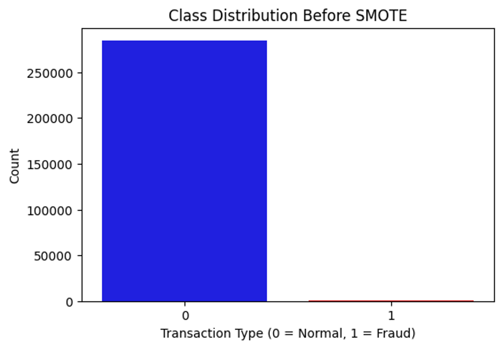
  &nbsp;&nbsp;&nbsp;
  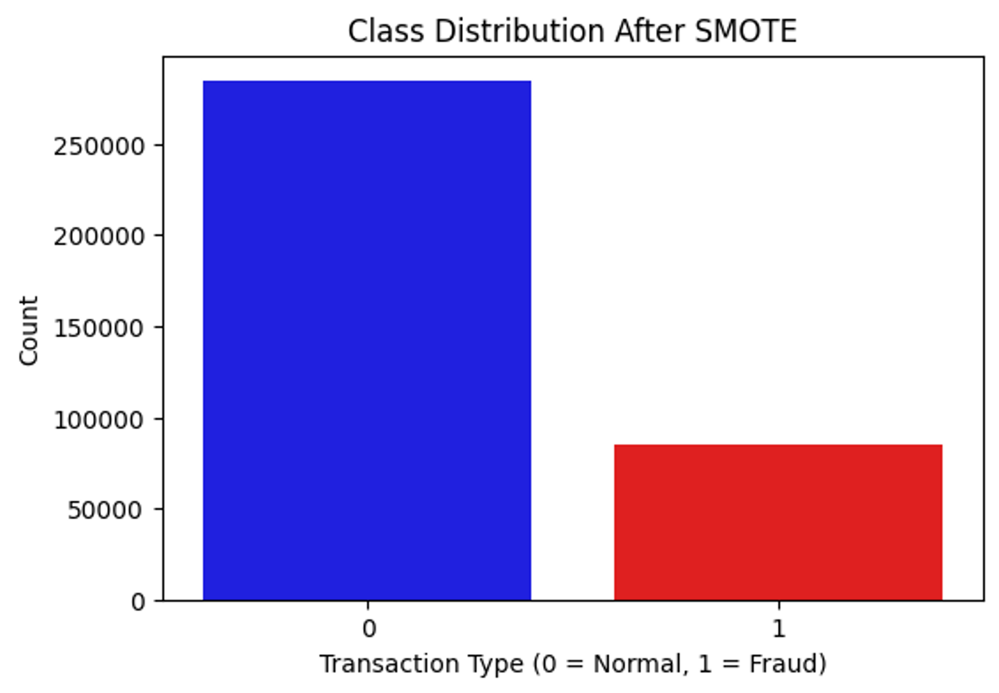

- **Modeling Techniques**:  
  - Logistic Regression  
  - K‑Nearest Neighbors (KNN)  
  - Random Forest  
  - XGBoost (balanced & imbalanced versions)  
  - Stacking-based **Hybrid Model** (Random Forest + XGBoost + LR)  

- **Evaluation**:
  - ROC‑AUC scoring & model comparison plots
     
       

  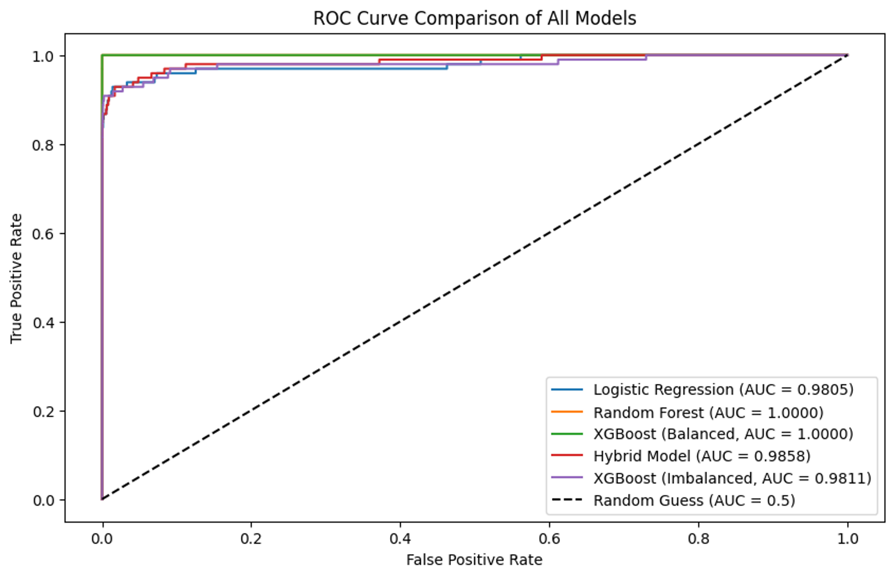

   - Confusion matrices for each classifier  

  
  &nbsp;&nbsp;&nbsp;
  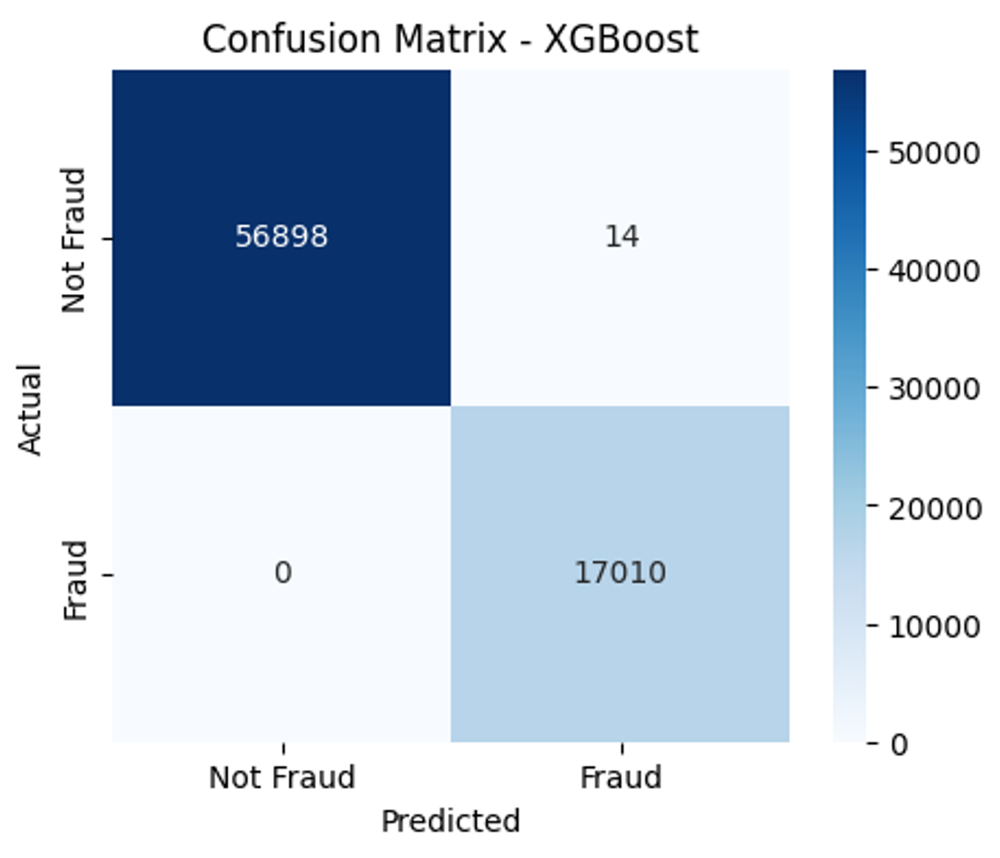

  
- **Explainability**: 
  - SHAP-based explainability for the XGBoost model
     
    

  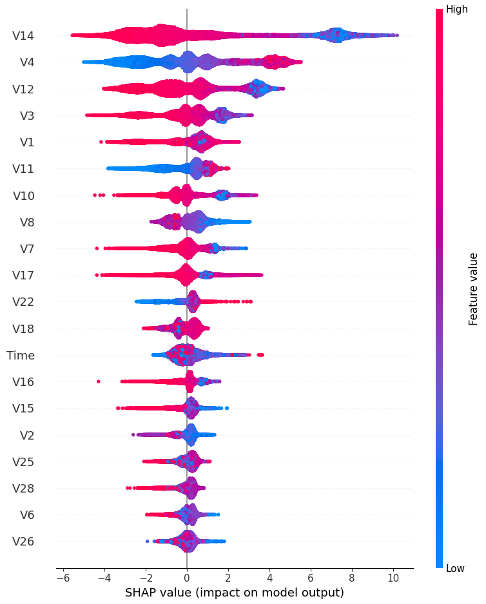
   
  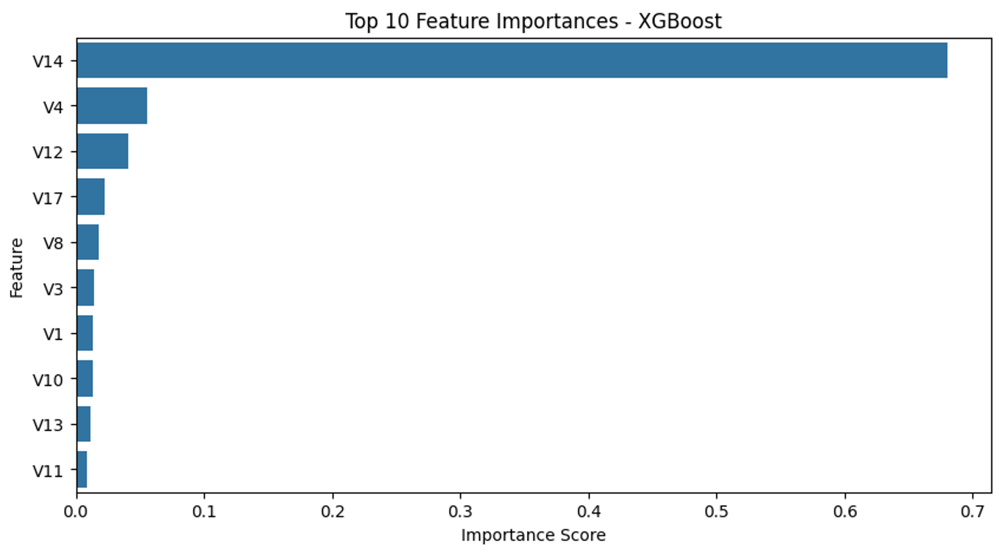

    
- **Interactive Web App**:  
  - Built with **Streamlit** (`app.py`)
     
       

  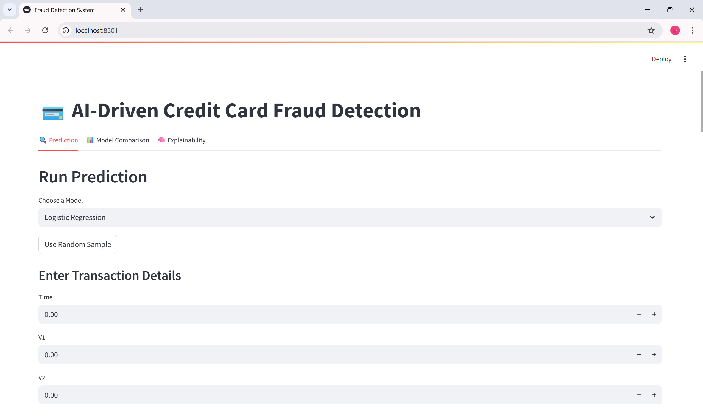
   

  - Allows users to pick a model, input transaction details, and get real-time fraud probabilities
    
   
  - Includes live AUC comparison charts
     
     
  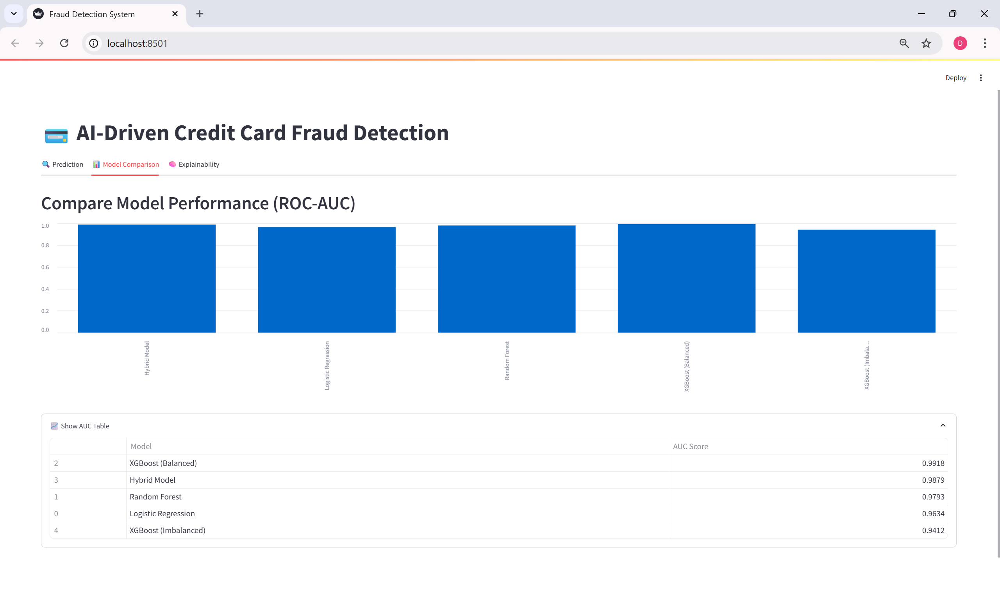
   
   
  
  - SHAP summary plots for interpretability
 
      
     
  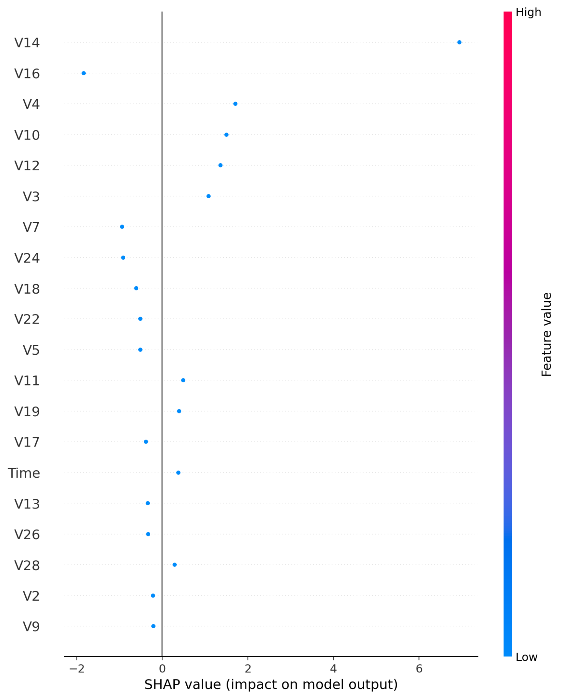
   
   

## 📁 Project Structure
- fraud_detection_app
    - app.py (Streamlit frontend)  
    - models
      - log_reg.pkl  
      - knn_model.pkl  
      - rf_model.pkl  
      - xgb_model.pkl  
      - hybrid_model.pkl   
   - notebooks
     - AIDCCFD&XAI.ipynb  
   - requirements.txt   
   - README.md
 
## 🚀 Setup & Run Locally
1. **Clone the repository**  
2. **Create & activate a virtual environment**
3. **Install dependencies**
4. **Place your dataset**
  - Add creditcard.csv inside the data/ folder
5. **Generate or download trained models**
  - Train models using the provided notebook
  - Or copy .pkl files into models
6. **Run the Streamlit app**
7. **Interact via Browser**

## Application Usage Guide
1. Select a **Model**
 
       
  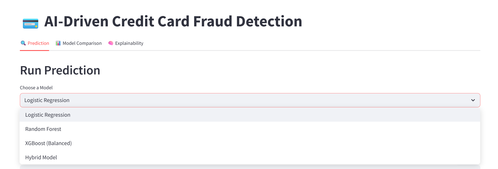
   
    
  
  
2. Enter input or Use **random Samples**
   
  
3. Click on **Predict** to see result
       
       

  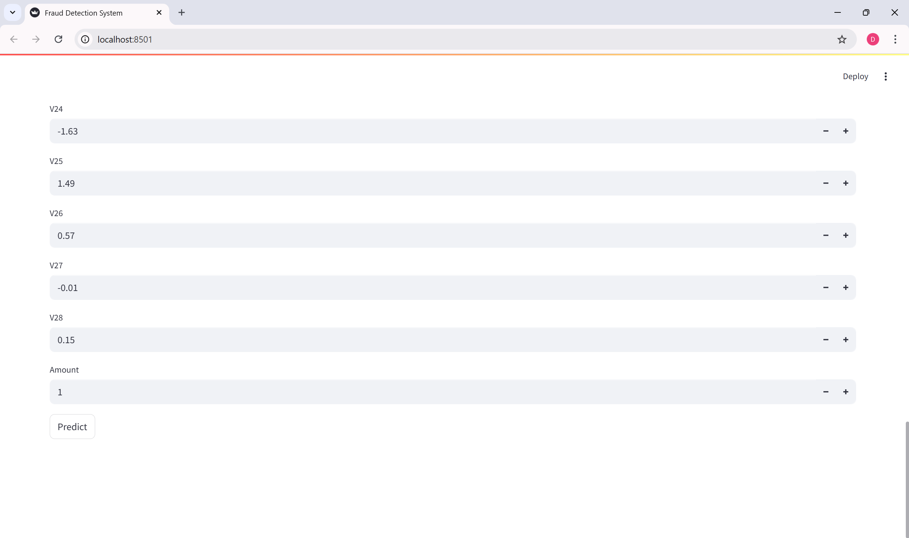
   
  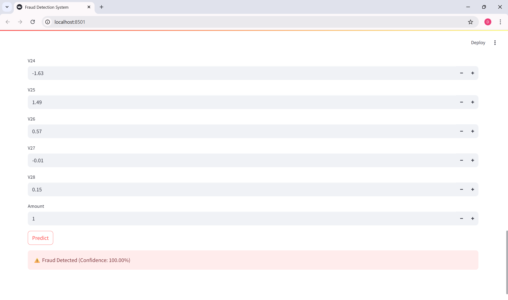
   
   

4. Use Explainability tab to:

- View SHAP summary plot

- Understand how each feature influenced the model

- Experiment with values to observe prediction changes

## Explainability with SHAP
What is SHAP?
- SHAP (SHapley Additive exPlanations) explains model predictions by attributing each feature’s contribution. It answers “why was this classified as fraud?”
### SHAP Summary Plot (in the App)
- Ranks features by importance
- Red = High feature value, Blue = Low value
- X-axis = SHAP value → impact on prediction
- Example:
  - If V14 (PCA feature) has high SHAP value and is blue:

  - High negative value of V14 strongly pushed prediction toward fraud
  
      
     
  
    &nbsp;&nbsp;&nbsp;
  
   
   
  
### What Happens When a Feature Changes?
SHAP lets you simulate changes:  
By changing any important feature values the predictions change this explains how the model interprets the data and makes decisions.

V14 Value changed from Low to High then the prediction changes to Legitimate transaction

  
     
  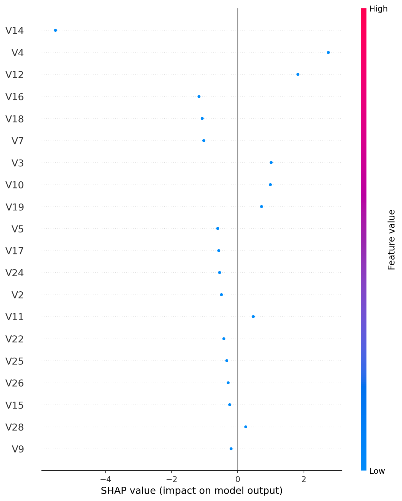
    &nbsp;&nbsp;&nbsp;
  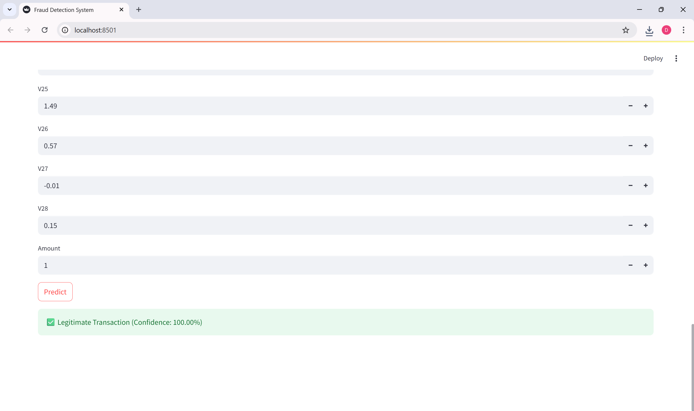
   
   
    
## Dataset
- Source: Kaggle - Credit Card Fraud Detection

- 284,807 transactions, with 492 frauds (~0.17% imbalance)

- Preprocessing:

  - PCA applied (V1–V28)

  - Normalized Amount, Time

  - SMOTE for balanced versions

## Techniques Used
- SMOTE for class imbalance handling

- XGBoost: Gradient boosting trees

- SHAP: Model-agnostic explainability

- Hybrid Model: Weighted ensemble of top models

